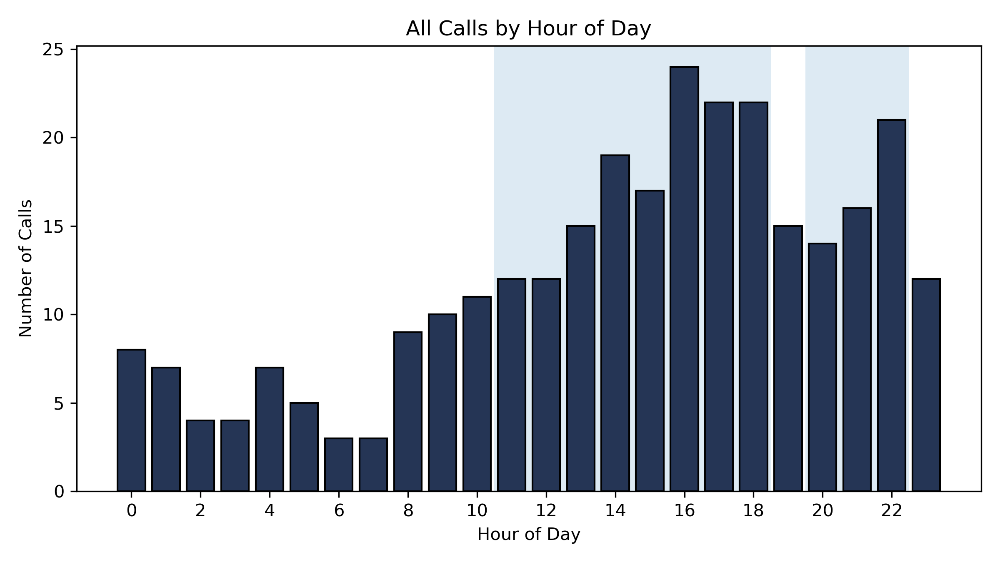

# 🚒 EMS Response Analytics Pipeline

## Overview
This project automates Fire/EMS incident data analysis to produce accurate, command-level reporting on system performance, response times, and operational workload.

The workflow reconciles multiple datasets to ensure total call volume is accurate while isolating only valid records for performance metrics.

---

## 🔥 Problem
Monthly reporting relied on a single call log dataset, which:

- Underreported total call volume  
- Excluded canceled or incomplete incidents  
- Produced misleading station workload metrics  

---

## ✅ Solution
Built a Python-based analytics pipeline that:

- Reconciles monthly incident list vs call log  
- Identifies missing or insufficient-data calls  
- Preserves true call volume by station  
- Excludes invalid data from performance metrics  

### Outputs:
- 📊 Charts  
- 📄 Word command report  
- 📈 (Optional) PowerPoint-ready outputs  

---

## 📊 Sample Output

---

## 🧠 Key Features

### Data Reconciliation
- Detects incidents present in monthly logs but missing in call logs  
- Flags and tracks insufficient data records  

### Accurate Workload Metrics
- Uses monthly dataset as source of truth  
- Credits all calls to correct stations  

### Performance Analysis
- 1st Due and Emergent call filtering  
- Average and 90th percentile response times  
- Delayed response identification (>480 sec)  

### System Load Analysis
- Overlapping incident detection  
- Identification of system stress periods  

### Automated Reporting
- Generates formatted Word reports  
- Produces presentation-ready visuals  

---

## 💣 Key Findings

- Peak system stress occurs between **1500–1700 hours**  
- Secondary spike observed around **2000 hours**  
- Delayed responses (>480 sec) correlate with **overlapping incidents**  
- **4 calls** were missing from the call log but included in total volume  

---

## ⚙️ Tech Stack

- Python  
- pandas  
- matplotlib  
- python-docx  

---

## 👤 Author

Michael Boulding  
Fire/EMS Operations Captain  
M.S. Data Analytics
